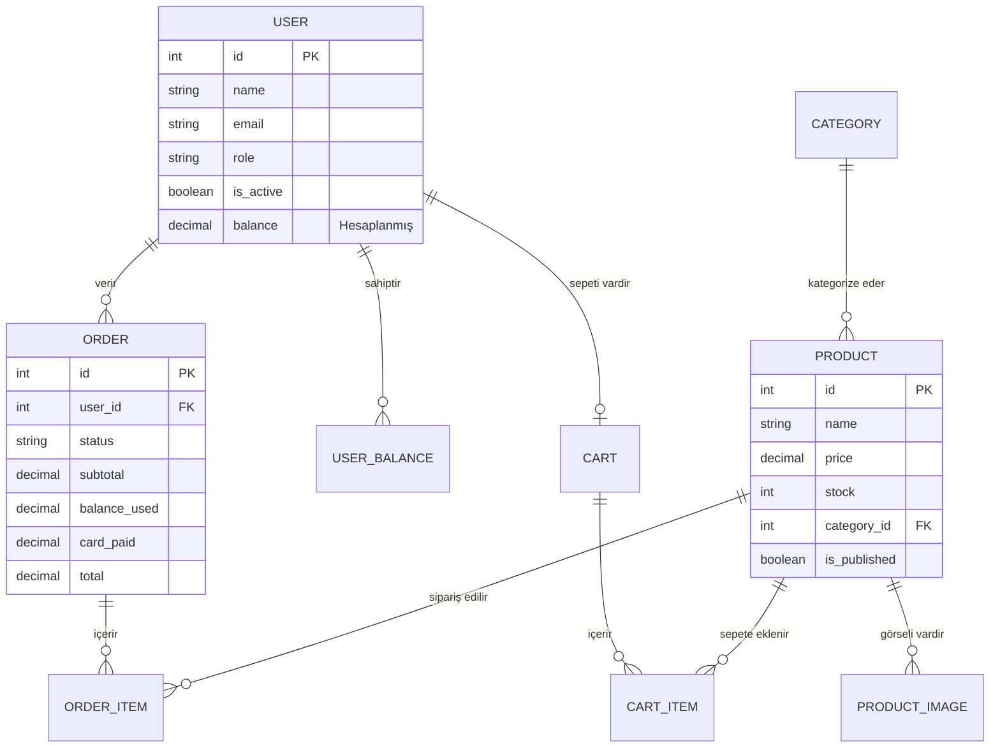
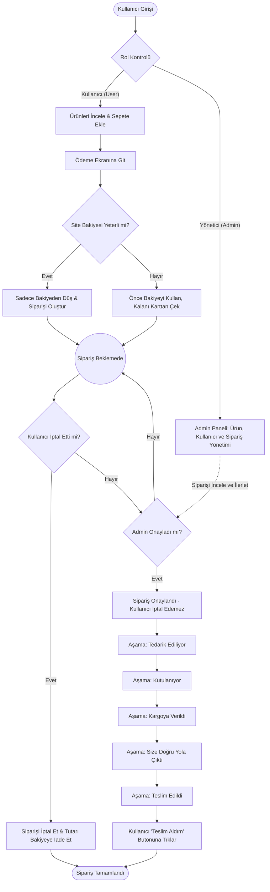

# İçerik Yönetim Sistemine Sahip Web Tabanlı Alış-Veriş Sitesi Geliştirme: "OneTap Bilgisayar"

**Özet** — Bu proje kapsamında, güncel web teknolojileri ve MVC (Model-View-Controller) mimarisi temel alınarak Laravel framework'ü ile tam donanımlı, dinamik ve kullanıcı dostu bir E-Ticaret / İçerik Yönetim Sistemi (CMS) tasarlanmış ve geliştirilmiştir. Sistem, "Yönetici" ve "Kullanıcı" olmak üzere iki farklı yetki seviyesine sahip aktörler için özel arayüzler ve işlevler sunmaktadır. "OneTap Bilgisayar" adındaki teknoloji ve bilgisayar donanımı mağazası konsepti üzerine inşa edilen uygulama, Render platformu üzerinde canlıya alınmıştır. Bu raporda, geliştirilen uygulamanın mimari yapısı, veritabanı modeli, algoritmik işleyişi ve elde edilen sonuçlar detaylandırılmaktadır.

## 1. Giriş

Gelişen internet altyapısı ve dijitalleşme ile birlikte, geleneksel fiziksel mağazacılık yerini hızla elektronik ticarete bırakmaktadır. Kullanıcıların mekân ve zaman bağımsız olarak alışveriş yapabilme ihtiyacı, modern, güvenli ve ölçeklenebilir e-ticaret platformlarının geliştirilmesini zorunlu kılmıştır. Bu projenin temel amacı, bir bilgisayar ve teknoloji mağazasının tüm iş süreçlerini (ürün yönetimi, stok takibi, sepet ve ödeme işlemleri, sipariş durumu takibi ve iade/bakiye yönetimi) dijital ortama taşıyan bir web otomasyonu geliştirmektir. 

Bu amaç doğrultusunda, Laravel MVC framework'ü tercih edilmiş; arka uçta PHP, veri yönetiminde PostgreSQL, ön uç tasarımında ise esnek (responsive) bir arayüz için Bootstrap / Tailwind CSS gibi teknolojiler entegre edilmiştir. Ayrıca dış API servisleri (Hava durumu vb.) sisteme entegre edilerek kullanıcı deneyimi zenginleştirilmiştir.

## 2. Yöntem ve Kullanılan Teknolojiler

Projenin geliştirilme sürecinde Yazılım Mühendisliği prensiplerine sadık kalınarak modüler bir yapı tercih edilmiştir. Geliştirme süreci şu katmanlardan oluşmaktadır:

*   **Model Katmanı:** Veritabanı tablolarıyla nesne yönelimli olarak iletişim kuran (Eloquent ORM) katmandır. Ürün (Product), Sipariş (Order), Kullanıcı (User), Sepet (Cart) gibi varlıklar bu katmanda tanımlanmıştır.
*   **View (Görünüm) Katmanı:** Kullanıcının etkileşime girdiği arayüzdür. Blade şablon motoru kullanılarak dinamik sayfalar üretilmiş ve mobil uyumluluk (Responsive Design) sağlanmıştır.
*   **Controller (Denetleyici) Katmanı:** Model ve View arasındaki iş mantığını (Business Logic) yürüten katmandır. Sepete ekleme, ödeme çekimi, bakiye hesaplama ve kullanıcı yetkilendirmeleri bu sınıflar üzerinden kontrol edilir.

Ödeme ve iade senaryosunda yenilikçi bir yöntem uygulanmıştır. Kullanıcı, siparişi henüz admin tarafından onaylanmadan önce iptal ederse, ödediği tutar doğrudan kredi kartına değil, site içi "Kullanıcı Bakiyesi" (Cüzdan) hesabına iade edilir. Bir sonraki alışverişte sistem öncelikle cüzdandaki bu bakiyeyi kullanır, kalan tutar varsa kredi kartından tahsil eder.

### 2.1. Varlık-İlişki (ER) Diyagramı

Sistemin temel veritabanı mimarisi, birbirleriyle ilişkili tablolar üzerine kurulmuştur. Aşağıdaki ER diyagramında kullanıcılar, ürünler, siparişler ve sepet yapısı arasındaki ilişkiler gösterilmektedir.

### 2.2. Algoritma ve Akış Diyagramı

Sipariş süreci, sistemin en karmaşık ve denetime tabi iş akışlarından biridir. Kullanıcının ürünü sepete eklemesinden, siparişin teslim alınmasına kadar geçen algoritma akışı aşağıda sunulmuştur.

## 3. Deneysel Sonuçlar ve Implementasyon Ayrıntıları

Proje veritabanına varsayılan olarak (Seeder aracılığıyla) 1 Yönetici, 5 Kullanıcı ve farklı kategorilerde (İşlemci, Ekran Kartı, RAM, Depolama, Monitör) 20'den fazla gerçekçi ürün verisi eklenerek testler gerçekleştirilmiştir. 

- **Rol Yönetimi (Middleware):** Admin yetkisi olmayan kullanıcıların yönetim paneli sayfalarına (ör. `/admin/*` rotaları) erişimi engellenmiş, HTTP 403 (Yasaklı) hatası dönmesi sağlanmıştır.
- **Dış API Kullanımı:** Proje kapsamında OpenWeatherMap (Günlük hava durumu bilgisi vb.) API servisleri entegre edilerek, kullanıcılara mağazanın bulunduğu konumun dinamik çevresel verileri (harita ve hava) sunulmuştur (sadece iframe değil, arka planda Guzzle/HTTP istekleri ile parse edilerek işlenmiştir).
- **Hosting ve Canlı Dağıtım (Deployment):** Uygulama, Render.com web sunucuları üzerinde barındırılmaktadır. Platformun "Native PHP" veya Docker çalışma zamanı ortamları kullanılarak sürekli entegrasyon (CI/CD) süreçleri başarılı bir şekilde yürütülmüştür. 

## 4. Kazanımlarınız

Bu proje kapsamında elde edilen temel mühendislik kazanımları şunlardır:
1.  **MVC Mimarisi Hakimiyeti:** Model, View ve Controller yapılarının fiziksel ve mantıksal izolasyonu gerçek dünya senaryolarında uygulanmıştır.
2.  **Veritabanı İlişkileri (ORM):** Bire-Bir (One-to-One), Bire-Çok (One-to-Many) gibi veritabanı ilişkileri SQL sorguları yazmak yerine Laravel Eloquent ORM üzerinden etkin bir şekilde kullanılmıştır.
3.  **İş Süreçleri ve Durum Makinesi (State Machine):** Bir siparişin baştan sona (Bekliyor -> Onaylandı -> Kutulanıyor -> Kargoda -> Teslim Edildi) durum geçişlerinin (Transitions) algoritmik olarak nasıl yönetileceği kavranmıştır.
4.  **Üçüncü Parti Entegrasyon:** Web API'lerine HTTP istekleri atıp dönen JSON formatındaki verileri parse ederek projede kullanma tecrübesi edinilmiştir.
5.  **Sunucu Dağıtımı:** Geliştirilen uygulamanın lokal (localhost) ortamdan çıkarılarak gerçek bir bulut sunucuya (Render.com) taşınması ve veritabanı göç (migration) işlemlerinin uzak sunucularda yapılması deneyimlenmiştir.

## 5. Sonuç

Proje gereksinimleri doğrultusunda, gelişmiş iş mantığına sahip (bakiye iadesi, onaylanma sonrası iptalin kilitlenmesi gibi) gerçekçi bir B2C e-ticaret platformu başarıyla hayata geçirilmiştir. Sistem esnek ve güvenli bir kod altyapısı üzerine kurulmuş olup, ilerleyen süreçlerde sanal POS entegrasyonu (PayTR, Iyzico vb.), gelişmiş faturalandırma (PDF formatında), kampanya/indirim kodları modülü gibi daha profesyonel eklentilerle genişletilmeye açıktır.

## Kaynakça

[1] Laravel Documentation, "Eloquent ORM, Controllers, Routing", laravel.com  
[2] PHP: Hypertext Preprocessor, "PHP 8.2 Official Manual", php.net  
[3] IEEE Standards Association, "Software Engineering Documentation Standards".  
[4] OpenWeatherMap API, "Current Weather Data", openweathermap.org  
[5] Render Cloud Hosting Platform, "Web Services Documentation", render.com
